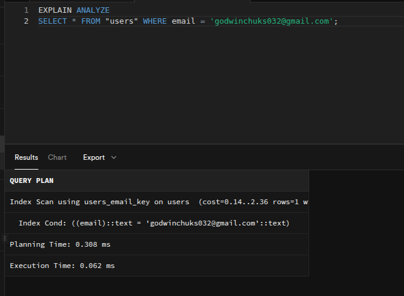
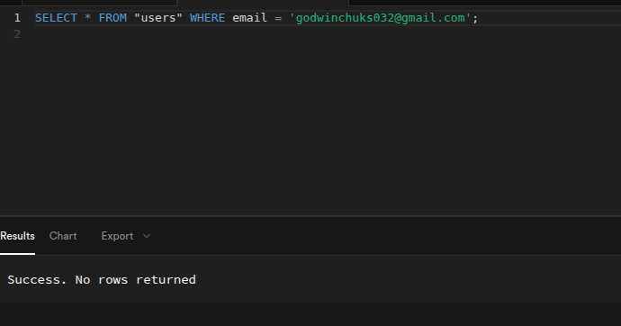

# Question 3
__Objective:__ Identify and create indexes to improve query performance.

__Instructions:__
- Identify high-usage columns in your User, Booking, and Property tables (e.g., columns used in WHERE, JOIN, ORDER BY clauses).
- Write SQL CREATE INDEX commands to create appropriate indexes for those columns and save them on database_index.sql
- Measure the query performance before and after adding indexes using EXPLAIN or ANALYZE.


## Identify high-usage columns in your User, Booking, and Property tables (e.g., columns used in WHERE, JOIN, ORDER BY clauses).
```sql
SELECT * FROM Users
WHERE email = 'godwinchuks032@gmail.com'
```


## Write SQL CREATE INDEX commands to create appropriate indexes for those columns and save them on database_index.sql
```sql
CREATE INDEX idx_users_email ON Users(email);
```

__With Index__



__Without Index__

